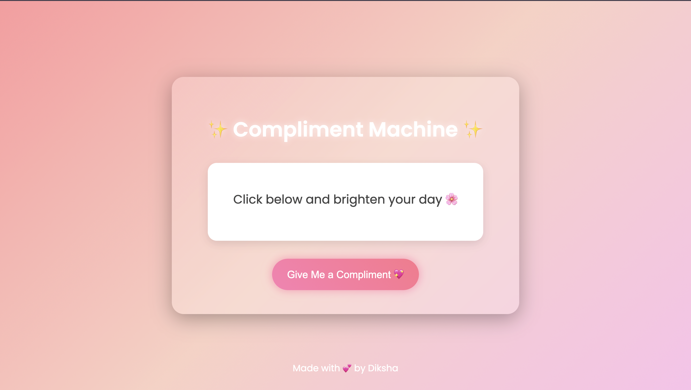
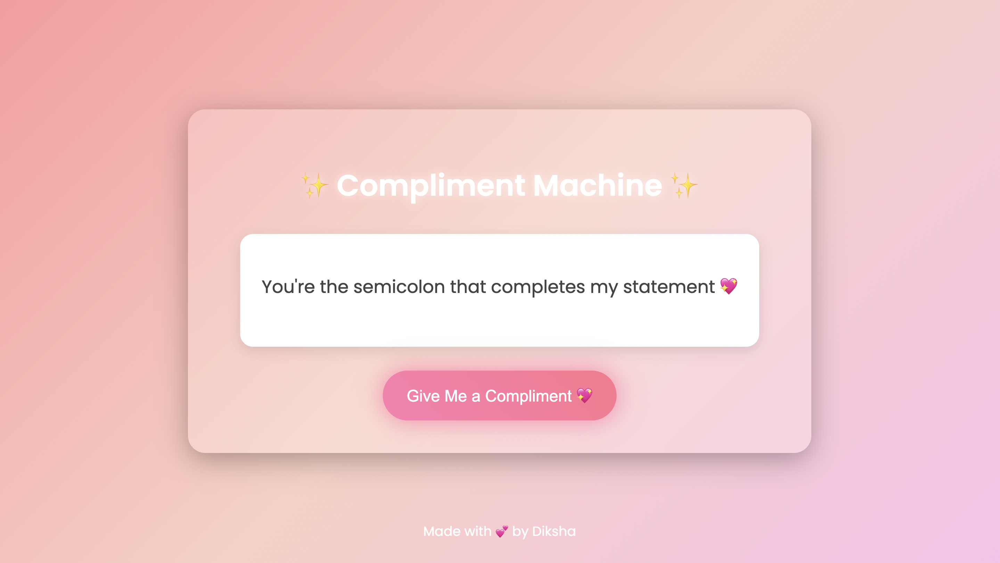

# Hack Culprit Virtual Internship - Project Report

## Project Title: COMPLIMENT MACHINE

### Submitted by:
**Name:** Diksha Jindal  
**Internship Role:** Virtual Intern  
**Organization:** Hack Culprit  
**GitHub Profile:** [@diksha-jindal](https://github.com/diksha-jindal)  
**Project Duration:** [06-10-2025] – [10-10-2025]  
**Project Repository:** [GitHub Repo URL]

---

## 1. Executive Summary

This document outlines the design, development, and implementation of the project titled **"COMPLIMENT MACHINE"**, undertaken as part of the Hack Culprit Virtual Internship. The objective was to build a practical, technically sound solution using modern tools and frameworks. The project enhances key skills such as problem-solving, collaboration through GitHub, and real-world application of theoretical knowledge.

---

## 2. Problem Statement

In the fast-paced digital world, people often feel stressed or demotivated while working online. This project addresses that gap by offering an interactive, mood-lifting web app that delivers random compliments, promoting positivity and mental well-being through a simple and engaging user experience

---

## 3. Project Objectives

- To gain practical exposure to full-cycle software development  
- To apply learned concepts in a real-world scenario  
- To utilize version control and collaborative tools effectively  
- To develop a feature-rich application that addresses a real problem  

---

## 4. Development Approach

The project was completed in four key stages:

- **Requirement Analysis & Planning** – Defined the project scope, selected tools (HTML, CSS, JavaScript), and set design goals.
- **Development** – Built the core compliment generation logic, UI design, and integrated speech and animation features. 
- **Testing & Debugging** – Performed iterative testing to ensure smooth functionality and responsiveness.  
- **Documentation & Deployment** – Created a detailed README and deployed the project for public access using version control tools.

---

## 5. Tools & Technologies

| Category       | Tools / Technologies Used               |
|----------------|------------------------------------------|
| Programming    | JavaScript, HTML, CSS                    |
| Frameworks     | Bootstrap                                |
| APIs           | Complimentr API (with local fallback)    |
| Tools          | Git, GitHub, VS Code                     |
| Deployment     | GitHub Pages                             |

---

## 6. Installation & Setup

To run this project locally, follow the steps below:

```bash
# Clone the repository
git clone https://github.com/diksha-jindal/COMPLIMENT-MACHINE.git

# Navigate to the project directory
cd project-name

# Install dependencies
pip install -r requirements.txt

# Run the application
python app.py

> Note: Ensure all required dependencies listed in requirements.txt are installed.
```
---

## 7. Key Features

Responsive and visually appealing interface with smooth animations

Random compliment generation using API and local fallback

Optional voice output for an interactive experience

Clean, well-structured, and modular JavaScript code

Works both online and offline seamlessly


---

## 8. Demonstration






---

## 9. Challenges Encountered

Integrating third-party libraries with minimal documentation

Implementing secure authentication and data encryption

Adapting to a new tech stack within limited time


---

## 10. Scope for Future Enhancements

Deploying the project on cloud (e.g., Heroku, Firebase Hosting)

Adding advanced user settings and preferences

Improving performance and scalability for large datasets

Integrating unit testing for better code quality assurance


---

## 11. Conclusion

This internship project significantly contributed to my technical and professional development. It offered a comprehensive experience in applying theoretical concepts to solve real-world problems while adhering to industry standards in code quality and documentation.


---

## 12. Acknowledgements

I would like to express my gratitude to the Hack Culprit team for the opportunity, mentorship, and support throughout this project. Special thanks to my peers and mentors who provided feedback and guidance during the development process.


---

## 13. License

This project is distributed under the MIT License
